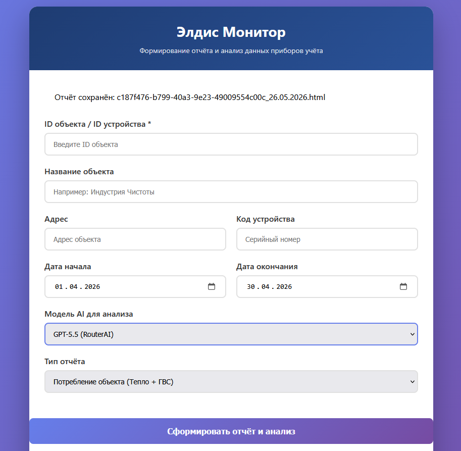

# ELDIS Monitor



Система мониторинга приборов учёта тепла, воды и ГВС через API ЭЛДИС с автоматической генерацией отчётов и AI-анализом.

## Возможности

- Получение суточных данных с теплосчётчиков (ВКТ-7, СПТ-941, ВКГ-3Т и др.)
- Генерация HTML-отчётов в формате ЭЛДИС с таблицами потребления
- Автоматические проверки: небаланс масс, перепад температур, отсутствие массы, тепловая энергия, нештатные ситуации
- AI-анализ с рекомендациями для сервисных инженеров (опционально, через RouterAI или NeuroAPI)
- Сбор данных со всех вводов прибора по одному ID

## Установка

```bash
# Клонирование
git clone https://github.com/your-username/eldis-monitor.git
cd eldis-monitor

# Виртуальное окружение
python3 -m venv venv
source venv/bin/activate  # Linux/Mac
venv\Scripts\activate     # Windows

# Зависимости
pip install -r requirements.txt
```

## Настройка

Скопируйте `.env.example` в `.env` и заполните параметры:

```bash
cp .env.example .env
```

Минимально необходимые параметры в `.env`:

```
ELDIS_API_URL=https://api.eldis24.ru
ELDIS_LOGIN=ваш_email
ELDIS_PASSWORD=ваш_пароль
ELDIS_API_KEY=ваш_api_ключ
```

Для AI-анализа (опционально):

```
ROUTERAI_API_KEY=ваш_ключ_routerai
```

## Запуск

```bash
python server.py
# Откройте http://localhost:5000
```

В веб-интерфейсе:
1. Введите ID объекта или прибора из личного кабинета ЭЛДИС
2. Выберите период
3. При необходимости выберите модель AI для анализа
4. Нажмите «Сформировать отчёт»

## Структура проекта

```
├── server.py              # Flask-сервер
├── templates/             # HTML-шаблоны
├── scripts/               # AI-анализаторы
├── app/                   # Модули приложения
│   ├── eldis/            # Работа с API ЭЛДИС
│   ├── analyzer/         # Анализ показаний
│   ├── collector/        # Сбор данных
│   └── alerts/           # Уведомления
├── Base/                  # Мануалы приборов
├── .env.example           # Пример конфигурации
└── requirements.txt       # Зависимости
```

## API ЭЛДИС

Система использует API ЭЛДИС версии 1/v2. Документация: https://developer.eldis24.ru

## Лицензия

MIT
